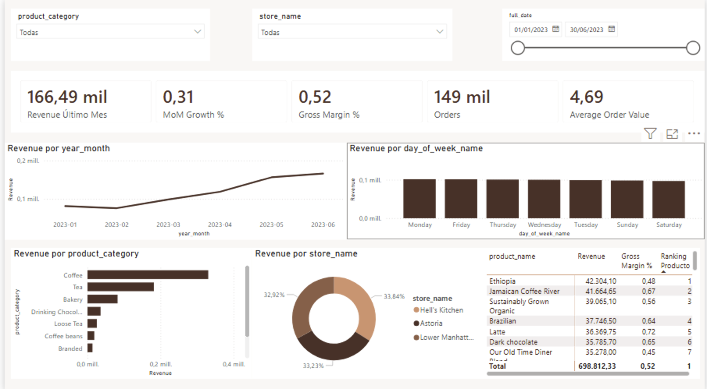
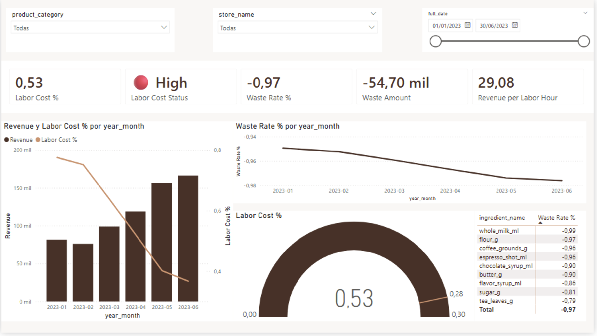
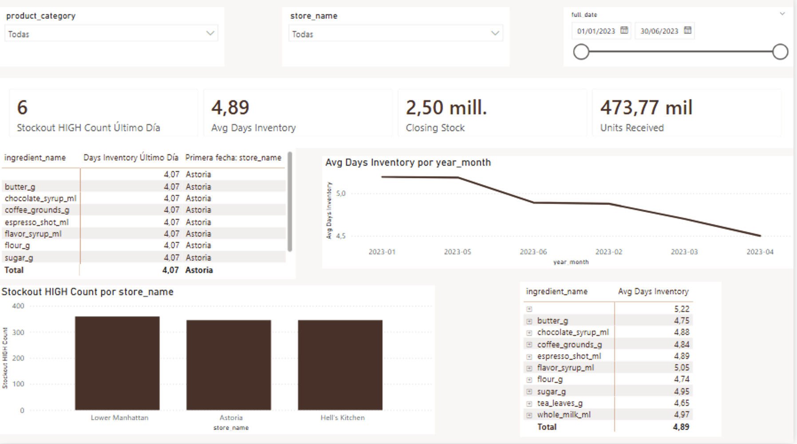

# BI y Dashboards

## Enfoque del proyecto
La capa de consumo usa `Athena + dbt Gold + Power BI`.
Power BI no se conecta en tiempo real a Athena en este repositorio; consume un snapshot CSV exportado desde Athena para mantener el flujo simple, reproducible y estable en entorno local.

## Modelo que consume Power BI

### Hechos
- `fct_sales`
- `fct_waste`
- `fct_labor`
- `fct_inventory_snapshot`

### Dimensiones
- `dim_date`
- `dim_store`
- `dim_product`
- `dim_ingredient`

## Estado actual de la capa BI
La entrega actual incluye `3 dashboards` funcionales en Power BI. La prioridad fue dejar un reporte coherente, con KPIs defendibles y conectado al modelo Gold real del proyecto.

No se forzó una capa visual "demasiado completa" con métricas no modeladas todavía. Algunas mejoras previstas para una siguiente iteración son:
- comparativos más avanzados de período anterior
- más KPIs visuales con semáforos
- refinamiento del layout y de la paleta visual
- expansión a dashboards adicionales por audiencia

## KPIs implementados
- `Revenue`: suma de `gross_revenue`
- `Revenue Último Mes`: revenue del último mes disponible en el filtro
- `MoM Growth %`: variación porcentual de revenue vs período anterior
- `Gross Profit`: suma de `gross_profit`
- `Gross Margin %`: `Gross Profit / Revenue`
- `Orders`: conteo de transacciones
- `Average Order Value`: `Revenue / Orders`
- `Labor Cost %`: `total_labor_cost / daily_revenue`
- `Labor Cost Status`: semáforo operativo derivado de `Labor Cost %`
- `Waste Amount`: suma de `waste_amount_usd`
- `Waste Rate %`: merma relativa sobre consumo teórico
- `Revenue per Labor Hour`: `daily_revenue / total_hours_worked`
- `Stockout HIGH Count Último Día`: ingredientes en riesgo `HIGH` en la última fecha de snapshot
- `Avg Days Inventory`: promedio de días de inventario restante
- `Closing Stock`: stock final del snapshot
- `Units Received`: unidades recibidas en inventario

## Dashboards entregados

### 1. Executive Dashboard
- Audiencia: dirección y operaciones
- Objetivo: resumir ventas, margen y volumen comercial del período filtrado
- KPIs visibles:
  - `Revenue`
  - `MoM Growth %`
  - `Gross Margin %`
  - `Orders`
  - `Average Order Value`
- Visuales principales:
  - tendencia de `Revenue` por mes
  - `Revenue` por día de semana
  - `Revenue` por categoría
  - `Revenue` por tienda
  - tabla de productos con revenue y margen



### 2. Labor & Waste Dashboard
- Audiencia: operaciones / tienda
- Objetivo: vigilar eficiencia laboral y comportamiento de merma
- KPIs visibles:
  - `Labor Cost %`
  - `Labor Cost Status`
  - `Waste Rate %`
  - `Waste Amount`
  - `Revenue per Labor Hour`
- Visuales principales:
  - `Revenue` y `Labor Cost %` por mes
  - `Waste Rate %` por mes
  - gauge de `Labor Cost %`
  - tabla de ingredientes con `Waste Rate %`



### 3. Inventory Dashboard
- Audiencia: operación de tienda / control de inventario
- Objetivo: detectar riesgo de quiebre y monitorear disponibilidad de ingredientes
- KPIs visibles:
  - `Stockout HIGH Count Último Día`
  - `Avg Days Inventory`
  - `Closing Stock`
  - `Units Received`
- Visuales principales:
  - tabla de ingredientes con días de inventario del último día
  - tendencia de `Avg Days Inventory`
  - `Stockout HIGH Count` por tienda
  - promedio de días de inventario por ingrediente



## Diferenciador del proyecto
La parte más fuerte del reporte sigue siendo la intersección entre ventas, labor, merma e inventario. Aunque la capa visual actual es una primera versión, ya demuestra que el proyecto no se queda en reporting de ventas:
- usa ventas POS
- cruza consumo teórico por receta
- incorpora snapshots de inventario
- agrega una vista operativa de labor

Eso convierte el modelo Gold en una herramienta de decisión, no solo en un dashboard descriptivo.

## Medidas DAX base

```dax
M_Revenue = SUM(fct_sales[gross_revenue])
M_Gross Profit = SUM(fct_sales[gross_profit])
M_Gross Margin % = DIVIDE([M_Gross Profit], [M_Revenue], 0)

M_Labor Cost = SUM(fct_labor[total_labor_cost])
M_Labor Revenue = SUM(fct_labor[daily_revenue])
M_Labor Cost % = DIVIDE([M_Labor Cost], [M_Labor Revenue], 0)

M_Waste Qty = SUM(fct_waste[waste_qty])
M_Waste Amount = SUM(fct_waste[waste_amount_usd])
M_Theoretical Consumption = SUM(fct_waste[theoretical_consumption])
M_Waste Rate % = DIVIDE(ABS([M_Waste Qty]), [M_Theoretical Consumption], 0)

M_Revenue per Labor Hour =
DIVIDE(SUM(fct_labor[daily_revenue]), SUM(fct_labor[total_hours_worked]), 0)
```

## Uso real
- Dirección / operaciones:
  - revisa `Executive Dashboard`
  - valida tendencia mensual, mix de ventas y productos con mejor revenue
- Operación de tienda:
  - revisa `Labor & Waste Dashboard`
  - identifica presión de labor y desviaciones de merma
- Control de inventario:
  - revisa `Inventory Dashboard`
  - detecta ingredientes en riesgo y días restantes de inventario
